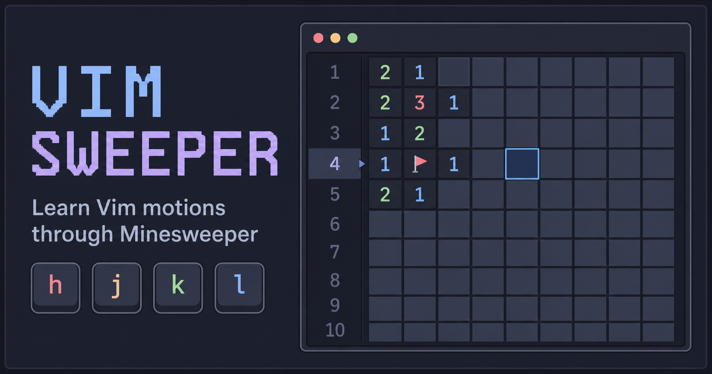

# Vim Sweeper

<p align="center">
  
</p>

Vim Sweeper is a keyboard-only Minesweeper game for practicing Vim motions and building muscle memory while you play.

Play it here: [wwdev-vim-sweeper.vercel.app](https://wwdev-vim-sweeper.vercel.app/)

## How to play

Move around the board with familiar Vim motions:

| Key                 | Action                     |
| ------------------- | -------------------------- |
| `h` `j` `k` `l`     | Move left, down, up, right |
| `w` / `b`           | Jump forward / backward    |
| `0` / `$`           | Start / end of the line    |
| `g` / `G` / `M`     | Top / bottom / middle      |
| `Ctrl-d` / `Ctrl-u` | Scroll down / up           |
| `Ctrl-f` / `Ctrl-b` | Scroll a screen down / up  |
| `x` / `Space`       | Open a cell                |
| `m` / `f`           | Flag a cell                |
| `Backspace`         | Show a hint                |
| `r`                 | Restart the game           |

You can prefix movement keys with a number, just like in Vim. For example, `5j` moves down five rows.

## Getting started

Requirements: Node.js and Yarn.

```bash
yarn
yarn dev
```

The development server will print a local URL to open in your browser.

Other commands:

```bash
yarn build    # Create a production build
yarn preview  # Preview the production build locally
yarn lint     # Run ESLint
```

## Built with

- React 19
- TypeScript
- Vite
- Tailwind CSS
- React Hotkeys Hook

## Related projects

- [minesweeper-tui](https://github.com/Pansther/minesweeper-tui) — terminal version of Minesweeper.
- [minesweeper.nvim](https://github.com/Pansther/minesweeper.nvim) — Minesweeper inside Neovim.
- [minesweeper-svelte](https://github.com/Pansther/minesweeper-svelte) — Minesweeper Svelte.

## Credits

The core game feature was built by me. The visual style and UI polish were created with Codex.
